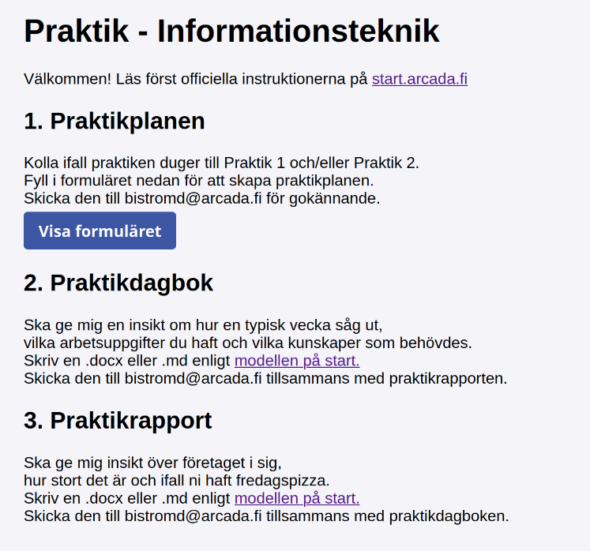
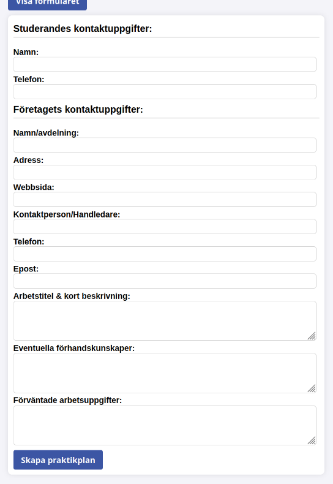

# TechLabs-PraktikGen
En simpel webbsida för att generera praktikplaner.

Man fyller i ett formulär och trycker på skapa praktikplan.
Då genereras en pdf som ungefär motsvarar Arcadas modell.
Modellen skickar man till mig för godkännande.

Genereringen är lokal, js-baserat
[jsPDF](https://github.com/parallax/jsPDF)

Såhär ser sajten ut:

Såhär ser formuläret ut:

